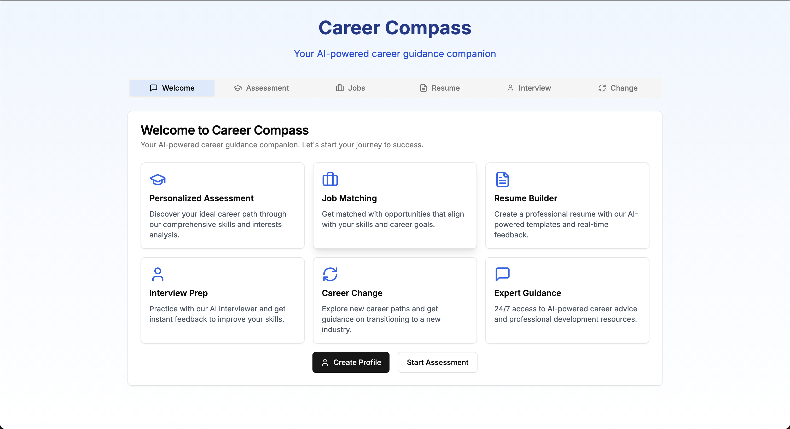

# Career Compass - AI-Powered Career Guidance Platform

Career Compass is a modern, AI-powered career guidance platform built with Next.js and TypeScript. It helps users navigate their career journey with personalized assessments, job matching, resume building, and interview preparation.

## UI Preview



## Features

- **Personalized Assessment**: Comprehensive skills and interests analysis to discover your ideal career path
- **Job Matching**: Smart matching with opportunities aligned to your skills and career goals
- **Resume Builder**: AI-powered resume templates with real-time feedback
- **Interview Preparation**: Practice interviews with AI interviewer and get instant feedback
- **Career Change Guidance**: Support for exploring and transitioning to new industries
- **Expert AI Guidance**: 24/7 access to career advice and professional development resources

## Tech Stack

- **Framework**: Next.js 14
- **Language**: TypeScript
- **Styling**: Tailwind CSS
- **UI Components**: 
  - Radix UI
  - Shadcn UI
  - Lucide React Icons
- **Form Handling**: React Hook Form
- **Validation**: Zod
- **Charts**: Recharts
- **Theme**: Next-themes for dark/light mode

## Getting Started

1. **Clone the repository**
   ```bash
   git clone https://github.com/Biji-Biji-Initiative/Career-JOBUI.git
   cd Career-JOBUI
   ```

2. **Install dependencies**
   ```bash
   npm install
   ```

3. **Run the development server**
   ```bash
   npm run dev
   ```

4. **Open your browser**
   Navigate to [http://localhost:3000](http://localhost:3000)

## Available Scripts

- `npm run dev` - Start development server
- `npm run build` - Build for production
- `npm run start` - Start production server
- `npm run lint` - Run ESLint

## Project Structure

- `/app` - Next.js 14 app directory with routes and layouts
- `/components` - Reusable UI components
  - `/ui` - Base UI components
  - User interface components (chat, profile, etc.)
- `/lib` - Utility functions and shared logic
- `/hooks` - Custom React hooks

## Contributing

We welcome contributions! Please feel free to submit a Pull Request.

## License

This project is licensed under the MIT License - see the LICENSE file for details. 